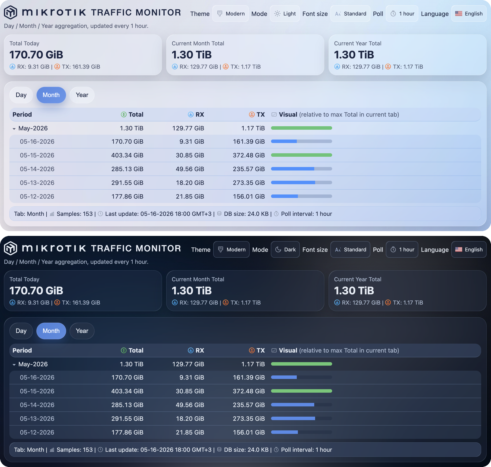

# MikroTik Traffic Monitor

Containerized MikroTik WAN traffic monitor with:
- hourly collection via SNMP
- SQLite persistence (recommended on USB storage)
- mini UI with day/month/year tabs (Total, RX, TX)
- Theme dropdown (`Modern` / `Classic`) and Mode dropdown (`Auto` / `Light` / `Dark`)
- UI with Language selector EN/RO (translations loaded from JSON files)
- mobile-friendly table: horizontal swipe to keep `Visual` column visible
- Month/Year expand works from arrow or period-cell tap (easier on mobile)
- JSON API for Home Assistant integration

## UI preview (Light + Dark)


## What it exposes
- UI: `http://<router-lan-ip>:8088/`
- CSV: `/day.csv`, `/month.csv`, `/year.csv`, `/info.txt`
- API: `/api/summary.json`, `/api/day.json`, `/api/month.json`, `/api/year.json`

## Repo structure
- `app/mt-traffic.sh` - runtime entrypoint: SNMP collector, SQLite writer, CSV/API generator, static UI server
- `app/www/index.html` - static frontend (glass UI, tabs Day/Month/Year, settings persistence)
- `app/i18n/languages.json` - language registry used by the UI selector
- `app/i18n/*.json` - translations
- `app/images/lang/*.svg` - language icons
- `app/images/ui/*.svg` - UI icons (theme, poll interval, metrics, status row)
- `app/images/ui/style-modern.css` - Modern (glass) theme stylesheet
- `app/images/ui/style-classic.css` - Classic theme stylesheet
- `mikrotik/install.rsc` - RouterOS install/deploy script (container, env, mount, NAT)
- `scripts/install-to-router.sh` - helper that uploads/imports `install.rsc` over SSH
- `homeassistant/mikrotik_traffic_package.yaml` - Home Assistant REST + template entities
- `homeassistant/dashboard_cards.yaml` - Lovelace example cards for stats view
- `docs/ui-light-dark.png` - README UI preview screenshot
- `.github/workflows/ci.yml` - CI checks
- `.github/workflows/docker-publish.yml` - multi-arch Docker build/publish to GHCR
- `.github/workflows/housekeeping.yml` - cleanup workflow for old runs/images

## Build image locally
```bash
docker build -t ghcr.io/ovikiss/mikrotik-traffic-monitor:local .
```

## Run locally
```bash
docker run --rm -p 8080:8080 \
  -e HTTP_PORT=8080 \
  -e MT_HOST=192.168.88.1 \
  -e MT_COMMUNITY=trafficdb \
  -e IFINDEX=auto \
  -e IFNAME_PATTERN=pppoe \
  -e POLL_INTERVAL=60m \
  -e TZ=Europe/Bucharest \
  -v "$PWD/data:/data" \
  ghcr.io/ovikiss/mikrotik-traffic-monitor:local
```

## Install on MikroTik
1. Edit variables at the top of `mikrotik/install.rsc`:
- `mtmVeth` (default `veth2`)
- `mtmDataPath` (default `/usb1/trafficdb`)
- `mtmRootDir` (default `/usb1/containers/trafficdb`)
- `mtmImage` (default `ghcr.io/ovikiss/mikrotik-traffic-monitor:latest`)
- `mtmIfIndex` (WAN ifIndex, default `auto` for PPPoE autodetect)
- `mtmIfNamePattern` (interface-name pattern for autodetect, default `pppoe`)
- `mtmPollInterval` (poll interval, default `1h`; UI allows `1h`, `3h`, `6h`, `12h`)
- `mtmHttpLanPort` (UI/API port, default `8088`, exported as env `HTTP_PORT`)

2. Import script:
```bash
./scripts/install-to-router.sh admin@192.168.88.1
```

Manual alternative:
```bash
scp mikrotik/install.rsc admin@192.168.88.1:install-traffic-monitor.rsc
ssh admin@192.168.88.1 '/import file-name=install-traffic-monitor.rsc'
```

## GitHub Actions container publish
Workflow triggers on:
- push tags `v*`
- manual `workflow_dispatch`

Published tags:
- on `v*` tag push: `ghcr.io/ovikiss/mikrotik-traffic-monitor:vX.Y.Z` and `ghcr.io/ovikiss/mikrotik-traffic-monitor:sha-...`
- on manual run from `main`: `ghcr.io/ovikiss/mikrotik-traffic-monitor:latest` and `ghcr.io/ovikiss/mikrotik-traffic-monitor:sha-...`

Build platforms:
- `linux/arm/v7`
- `linux/arm64`

## Home Assistant integration
- Runtime API sample: `/api/home_assistant_rest_example.yaml`
- Repo sample package: `homeassistant/mikrotik_traffic_package.yaml`
- Example dashboard: `homeassistant/dashboard_cards.yaml`

## Notes
- RouterOS container package must be installed and enabled.
- Use external USB storage for `root-dir` and DB path.
- SNMP community is scoped to container IP (`/32`) by install script.

## DB size estimate (1h polling)
- Practical example: `74 samples -> 16.0 KB` SQLite DB.
- At `1 sample/hour` (`~8760 samples/year`), linear estimate is about `~1.8-2.0 MB/year`.
- With SQLite overhead and normal growth variance, a safe planning range is `~2-5 MB/year`.

## Trademark Notice
- MikroTik name and logo are official trademarks of MikroTik.
